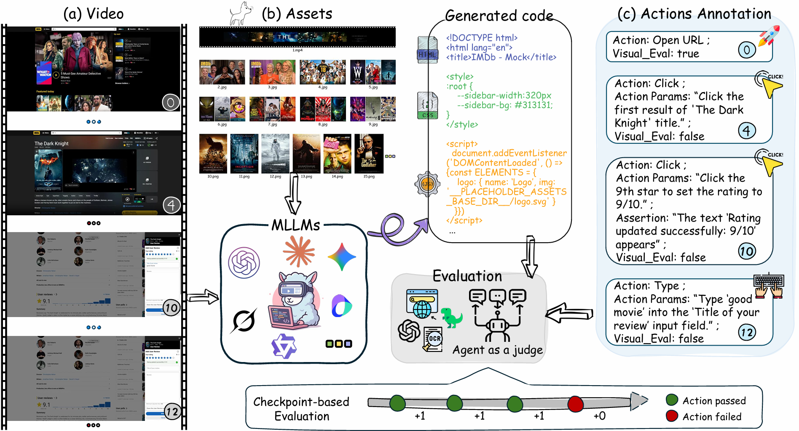

#  IWR-Bench: Can LVLMs reconstruct an interactive webpage from a user interaction video?

[](https://arxiv.org/abs/2509.24709)
[](https://huggingface.co/datasets/IWR-Bench/IWR-Bench)
[](https://github.com/L-O-I/IWR-Bench)
[](https://l-o-i.github.io/IWR-Bench/)

## Introduction

<div align="center">
  
</div>

*Figure: Performance of 10 representative models on IWR-Bench.*

**IWR-Bench** is a novel benchmark designed to evaluate the ability of Large Vision-Language Models (LVLMs) to reconstruct **dynamic, interactive webpages** from user interaction videos.

Existing benchmarks primarily focus on static "screenshot-to-code" tasks, overlooking the dynamic interactions that are fundamental to modern web applications. IWR-Bench addresses this gap by proposing a challenge that more closely aligns with real-world scenarios: models must not only understand a webpage's visual layout but also infer its interaction logic (e.g., clicks, inputs, state changes) from a video and generate fully functional code.

<div align="center">
  
</div>

*Figure: Overview of the IWR-Bench task and evaluation workflow. The model receives (a) a user interaction video and (b) all static assets for the webpage as input, then generates interactive web code. We employ an 'Agent-as-a-Judge' framework to automatically assess the interactive functionality and visual fidelity of the generated page by executing (c) a predefined ground-truth action sequence.*


## Core Features
- **Real-World Tasks**: Features 113 meticulously curated tasks from 100 real-world websites, covering a wide range of domains, visual styles, and interaction patterns.
- **Dynamic Interaction Videos**: The input is not a static screenshot but a video capturing a complete, stateful interaction workflow, posing a greater challenge to the model's temporal reasoning capabilities.
- **Complete Development Assets**: Each task provides all necessary static assets (e.g., images, icons, videos), simulating a realistic web development environment.
- **Functionality-Centered Evaluation**: We developed an 'Agent-as-a-Judge' automated evaluation framework that programmatically executes an action sequence to assess the **Interactive Functionality Score (IFS)** and **Visual Fidelity Score (VFS)** of the generated webpage.


## Main Result
Our extensive evaluation of 28 leading LVLMs reveals critical bottlenecks in current models' capabilities for this task.

| Model | Low-level Visual | High-level Visual | IFS | VFS | Final Score |
| :--- | ---: | ---: | ---: | ---: | ---: |
| **Proprietary MLLMs** | | | | | |
| GPT-5 | 68.29 | 60.21 | 24.39 | 64.25 | 36.35 |
| Claude-Sonnet-4 (thinking) | 64.90 | 55.51 | 23.65 | 60.20 | 34.62 |
| Claude-Opus-4 (thinking) | 63.53 | 53.80 | 23.61 | 58.67 | 34.13 |
| Doubao-seed-1.6 | 65.95 | 55.62 | 22.55 | 60.79 | 34.02 |
| Claude-Sonnet-4 | 65.75 | 56.92 | 22.29 | 61.34 | 34.00 |
| Claude-Opus-4 | 65.23 | 55.13 | 21.83 | 60.18 | 33.33 |
| GPT-5-mini | 63.36 | 50.25 | 23.18 | 56.81 | 33.27 |
| GPT-4.1 | 63.07 | 54.63 | 20.48 | 58.85 | 31.99 |
| Gemini-2.5-Pro (thinking) | 54.52 | 46.83 | 21.65 | 50.67 | 30.36 |
| Gemini-2.5-Pro | 57.46 | 48.91 | 20.51 | 53.18 | 30.31 |
| GPT-4o (latest) | 63.39 | 51.71 | 17.55 | 57.55 | 29.55 |
| Gemini-2.5-Flash | 47.53 | 37.75 | 19.88 | 42.64 | 26.71 |
| GPT-5-nano | 53.49 | 35.70 | 18.17 | 44.59 | 26.10 |
| Grok-4 | 48.95 | 30.54 | 19.44 | 39.74 | 25.53 |
| GPT-4o (0806) | 54.03 | 39.83 | 15.87 | 46.93 | 25.19 |
| Doubao-seed-1.6-flash | 45.49 | 32.06 | 16.34 | 38.78 | 23.07 |
| Gemini-2.5-Flash-Lite | 28.95 | 19.05 | 13.29 | 24.00 | 16.50 |
| Kimi-VL (thinking) | 26.18 | 12.23 | 12.04 | 19.20 | 14.19 |
| **Open-Source MLLMs** | | | | | |
| Qwen3-VL (thinking) | 58.55 | 46.13 | 22.07 | 52.34 | 31.15 |
| Qwen2.5-VL-72B | 47.83 | 28.25 | 17.42 | 38.04 | 23.61 |
| Qwen2.5-VL-32B | 39.36 | 23.30 | 16.50 | 31.33 | 20.95 |
| Keye-VL-1.5-8B | 30.81 | 15.49 | 16.06 | 23.15 | 18.18 |
| MiniCPM-V-4.5 | 31.18 | 15.41 | 15.58 | 23.29 | 17.89 |
| Qwen2.5-VL-7B | 28.92 | 12.20 | 13.28 | 20.56 | 15.47 |
| Mimo-VL-7B | 23.28 | 4.99 | 10.57 | 14.14 | 11.64 |
| GLM-4.5V | 16.31 | 10.52 | 10.11 | 13.41 | 11.10 |
| **Open-Source Video-Specialized LMs** | | | | | |
| VideoLLaMA3-7B | 31.29 | 11.86 | 10.29 | 21.58 | 13.67 |
| InternVideo-2.5-Chat-8B | 17.27 | 3.33 | 9.97 | 10.30 | 10.07 |

*Last updated: September 24, 2025*


## Key Findings

- **Highly Challenging Task**: Even the top-performing model (GPT-5) achieves an overall score of only **36.35%**, indicating that interactive webpage reconstruction is a largely unsolved problem.
- **Functionality is the Main Bottleneck**: Models show moderate success in replicating static visual layouts (highest VFS of 64.25%), but their ability to generate correct, event-driven logic is severely limited (highest IFS of only **24.39%**).
- **General Multimodal Capabilities are Key**: General-purpose LVLMs generally outperform models specialized for video understanding, suggesting that strong code generation and multimodal reasoning are more critical than specialized video-processing architectures for this task.

## Dataset
The IWR-Bench dataset consists of 113 tasks, each including:
- A user interaction video
- All required static assets for the webpage
- A ground-truth action sequence for evaluation
- Ground-truth screenshots after each action step
The dataset is publicly available on the HuggingFace Hub:
- **HuggingFace Datasets**: [IWR-Benchmark](https://huggingface.co/datasets/IWR-Bench/IWR-Bench)

## Evaluation

### Setup
```bash
git clone https://github.com/SIGMME/IWR-Bench.git
cd IWR-Bench

# Download data
cd data
git clone https://huggingface.co/datasets/IWR-Bench/IWR-Bench
cp IWR-Bench/* .
cd ..

# Environment
pip install -r requirements.txt
cd utils/browser-use
pip install -e .
playwright install
cd ../../

# Copying and editing a configuration
cp .env.example  .env
```

### Run Evaluation
``` bash
# Running the Evaluation
export model_name="gpt-5-2025-08-07"

python ./generate.py \
    --data ./data/data.jsonl \
    --result ./outputs \
    --model $model_name \
    --workers 50

python3 ./evaluate.py \
    --data ./data/data.jsonl \
    --result ./outputs \
    --model $model_name

```


## Citation
If you use IWR-Bench in your research, please cite our paper:

```bibtex
@article{chen2025iwr,
  title={IWR-Bench: Can LVLMs reconstruct interactive webpage from a user interaction video?},
  author={Chen, Yang and Liu, Minghao and Shen, Yufan and Li, Yunwen and Huang, Tianyuan and Fang, Xinyu and Zheng, Tianyu and Huang, Wenxuan and Yang, Cheng and Fu, Daocheng and others},
  journal={arXiv preprint arXiv:2509.24709},
  year={2025}
}
```
