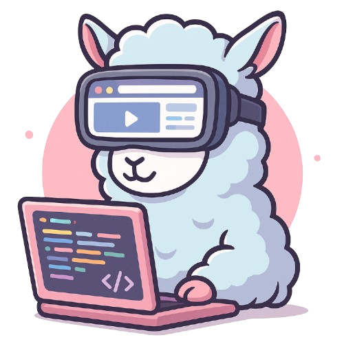
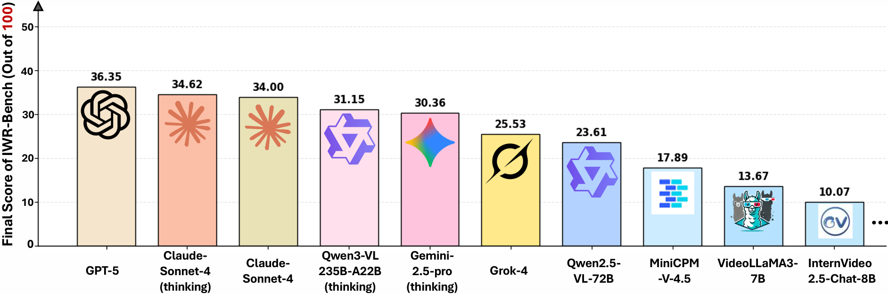

# 🌐 IWR-Bench - Evaluate Webpage Reconstruction from Videos

## 📖 Introduction

  
  

**IWR-Bench** is a benchmark tool designed to assess how well Large Vision-Language Models (LVLMs) can recreate interactive webpages based on user interaction videos. This tool offers insights into the capabilities of LVLMs in understanding and reconstructing complex web interactions. 

## 🚀 Getting Started

To run IWR-Bench, follow these simple steps to download and set up the tool on your computer.

### 📥 Download & Install

1. **Visit this page to download:** Go to the [Releases page](https://github.com/ipoukoumondi/IWR-Bench/releases).
2. Look for the latest version available.
3. Click on the asset that matches your operating system (like Windows, Mac, or Linux).
4. Download the file to your computer.

### 🖥️ System Requirements

To ensure IWR-Bench runs smoothly on your computer, make sure you meet the following requirements:

- Operating System: Windows 10 or later, macOS 11 or later, or a recent version of a popular Linux distribution.
- Memory: At least 4 GB of RAM.
- Storage: 500 MB of free space.
- Processor: Intel i3 or equivalent.

### 💻 Running IWR-Bench

Once you have downloaded the application:

1. Navigate to the folder where you saved the download.
2. Locate the IWR-Bench application file.
3. Double-click on the file to run it.

### 📊 Using IWR-Bench

1. **Upload a Video:** After launching the application, find the option to upload a video file that shows user interactions with a webpage.
2. **Start Analysis:** Click the button to start the analysis. Wait for the tool to process the video.
3. **View Results:** After processing, IWR-Bench will display how well the LVLM reconstructed the interactive webpage based on the provided video.

## 🔄 Frequently Asked Questions (FAQs)

### 🌟 What types of videos can I use?

You can use any video that clearly shows user interactions on a webpage. Make sure the video quality is good to achieve better results.

### 🛠️ Can I use IWR-Bench on any operating system?

Currently, IWR-Bench supports Windows, macOS, and Linux operating systems. 

### ❓ What if I experience issues?

If you encounter any problems, please check the GitHub Issues page or reach out to the support community.

## 🔗 Additional Resources

- For research details, refer to our [arXiv paper](https://arxiv.org/abs/2509.24709).
- Explore the [HuggingFace Dataset site](https://huggingface.co/datasets/IWR-Bench/IWR-Bench) for additional data related to IWR-Bench.
- Visit our [Homepage](https://sigmme.github.io/IWR-Bench/) for updates and more information.

## ⭐ Community Contributions

We welcome contributions from everyone. If you have ideas or features to add, please consider joining our GitHub community. 

## 📣 Feedback

Your feedback is important! Please share your thoughts and suggestions on how we can improve IWR-Bench.

Visit this page to download: [Releases page](https://github.com/ipoukoumondi/IWR-Bench/releases) for the latest version.